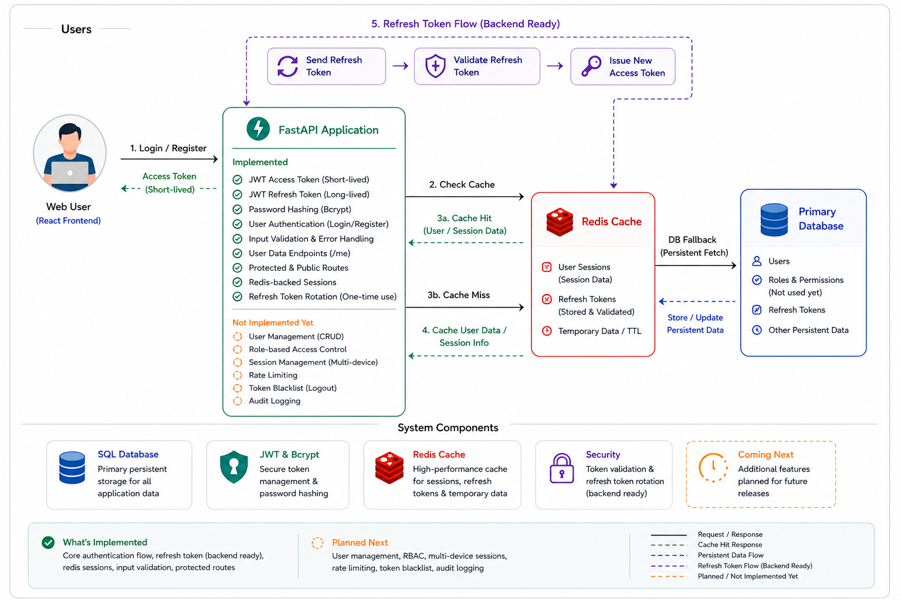

# 🚀 FastAPI Authentication System (Full Stack)

A **production-ready, scalable authentication system** built with **FastAPI (Backend)** and **React (Frontend)**.  
This project reflects a **real backend engineering journey**, focusing on performance, scalability, and system design.

---

# 🧠 Project Vision

This system was built to understand how real systems evolve:


Database Bottleneck → Optimization → Async Scaling → System Limits


---

# 🔥 Key Features

## 🔹 Backend
- 🔐 JWT Authentication (Access + Refresh Tokens)
- 👤 User Registration & Login
- ⚡ Fully Async Architecture (FastAPI + asyncpg)
- 🗄️ PostgreSQL with connection pooling
- 🚀 Redis caching for performance optimization
- 📊 Load testing with Locust
- 📈 Performance benchmarking
- 🔄 Multi-worker scalability (Uvicorn)

## 🔹 Frontend
- 🔑 Login & Registration UI
- 🔐 JWT-based authentication flow
- 🔄 Persistent login (auto user load)
- 🛡️ Protected & Public routes
- ⚡ Axios interceptors (token + error handling)
- 🧠 Redux Toolkit state management
- ✅ Form validation

---

# 🏗️ System Architecture


Client (React)
↓
FastAPI Backend
↓
Redis Cache
↓
PostgreSQL
↓
JWT Auth Layer


---

## Architectural Design
Shows interactions between FastAPI, Redis, and PostgreSQL with JWT-based authentication.

---

# 🧰 Tech Stack

## 🔹 Backend

| Layer | Technology |
|------|-----------|
| Framework | FastAPI |
| Database | PostgreSQL |
| ORM | SQLAlchemy (Async) |
| Cache | Redis |
| Auth | JWT (python-jose) |
| Hashing | bcrypt (passlib) |
| Load Testing | Locust |

## 🔹 Frontend

| Layer | Technology |
|------|-----------|
| Framework | React (CRA) |
| State | Redux Toolkit |
| Routing | React Router |
| API | Axios |
| Styling | CSS |

---

# 📁 Complete Project Structure


FastAPI-Authentication-System/
│
├── backend/
│ ├── app/
│ │ ├── core/
│ │ │ └── redis.py
│ │ │
│ │ ├── routes/
│ │ │ ├── auth_routes.py
│ │ │ ├── user_routes.py
│ │ │ └── redis_routes.py
│ │ │
│ │ ├── auth.py
│ │ ├── config.py
│ │ ├── database.py
│ │ ├── dependencies.py
│ │ ├── logger.py
│ │ ├── main.py
│ │ ├── models.py
│ │ └── schemas.py
│ │
│ ├── diagrams/
│ ├── performance/
│ ├── tests/
│ ├── logs/
│ ├── requirements.txt
│ └── README.md
│
├── frontend/
│ ├── public/
│ ├── src/
│ │ ├── api/
│ │ ├── app/
│ │ ├── components/
│ │ ├── features/auth/
│ │ ├── pages/
│ │ ├── routes/
│ │ ├── utils/
│ │ ├── styles/
│ │ ├── App.jsx
│ │ └── index.js
│ │
│ ├── .env
│ ├── package.json
│ └── README.md
│
└── README.md


---

# 🚀 Backend Setup

```bash
# Clone repository
git clone <your-repo-url>

cd FastAPI-Authentication-System/backend

# Install dependencies
pip install -r requirements.txt
Start Services
# PostgreSQL (ensure running)

# Redis (Docker)
docker run -d -p 6379:6379 redis
Run Backend
uvicorn app.main:app --workers 4
🚀 Frontend Setup
cd frontend

npm install
npm start
🌐 Backend URL
http://127.0.0.1:8000
🔐 Authentication Flow
Register/Login → Get Tokens
                ↓
        Store Access Token
                ↓
     Attach via Axios Interceptor
                ↓
        Access Protected Routes
                ↓
     Refresh Token when expired
📊 Performance Journey
Phase 1: Initial System
High latency
DB bottleneck
Phase 2: PostgreSQL Optimization
Connection pooling added
Phase 3: bcrypt Optimization
Reduced hashing cost
Phase 4: Redis Integration
Cached /users/me
Reduced DB load
Phase 5: Multi-worker Scaling
Improved concurrency
⚡ Phase 6: Async Migration & Load Testing
Objective

Evaluate performance after async migration:

FastAPI async
SQLAlchemy async engine
asyncpg
Redis caching
🔹 Scenario 1: 400 Users (Spawn 5)
RPS: ~100
Avg Latency: ~1555 ms
Failure Rate: ~0.02%

✅ Stable

🔹 Scenario 2: 800 Users (Spawn 5)
RPS: ~116
Avg Latency: ~3726 ms
Failure Rate: ~0.06%

⚠️ High latency but stable

🔹 Scenario 3: 400 Users (Spawn 10)
RPS: ~40
Avg Latency: ~6493 ms
Failure Rate: ~14%

❌ System breakdown

🔍 Key Findings
Async handles steady load well
System fails under burst traffic
DB pool saturation occurs
bcrypt becomes CPU bottleneck
🔐 Phase 7: Token System Upgrade
Introduced Access Token + Refresh Token
Improved session handling
Reduced frequent logins
Prepared system for scalability
📌 Final Insights
Redis removed DB bottleneck
System became CPU-bound
Async improved scalability
Burst traffic still breaks system
🚀 Future Improvements
Rate limiting (critical)
Backpressure handling
Background workers
Load balancing (Nginx)
Horizontal scaling
UI improvements (Frontend)
🧠 Key Learnings
Backend system design
Async architecture
Load testing & benchmarking
Bottleneck identification
Real-world scalability challenges
👨‍💻 Author

Aniket Paswan
Aspiring AI Engineer | Backend Developer

⭐ Final Note

This project reflects a real engineering mindset:

Optimize → Measure → Break → Improve → Repeat